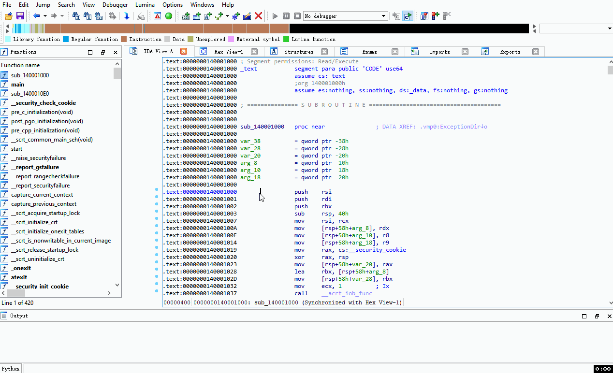

# Introduction
This project is just a POC and only works with VMProtect 3.x (not including the demo version).

NOT CLEAN CODE.

Although x86 is now available, unfortunately x86 cannot coexist with x64.


## 1. Install pyvtil first

```bash
git clone -b dev-1 https://github.com/wallds/VTIL-Python.git
cd VTIL-Python
py setup.py install --old-and-unmanageable
```
**To use x86 you need to replace `dev-1` with `dev-x86`.**
## 2. Install plugin
Copy novmpy&novmpy.py to IDA plugin directory.

## 3. Usage


## Support list
Version       | x86 | amd64 | arm64
:------------ | :-------------| :-------------| :-------------
VMProtect 3.x | :heavy_check_mark: |  :heavy_check_mark: |


# Reference

https://github.com/can1357/NoVmp

https://github.com/0xnobody/vmpattack

https://github.com/vtil-project/VTIL-BinaryNinja
